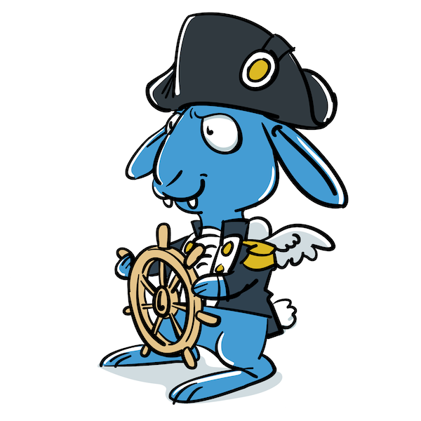

[](https://github.com/foomo/squadron/actions/workflows/pr.yml)
[](https://goreportcard.com/report/github.com/foomo/squadron)
[](https://coveralls.io/github/foomo/squadron?branch=main)
[](https://godoc.org/github.com/foomo/squadron)

<p align="center">
  
</p>

# Squadron

Application for managing kubernetes microservice environments.

Use it, if a helm chart is not enough in order to organize multiple services into an effective squadron.

Another way to think of it would be `helm-compose`, because it makes k8s and helm way more approachable, not matter if it is development or production (where it just becomes another helm chart)

## Configuration `squadron.yaml`

Configure your squadron

```yaml
# https://raw.githubusercontent.com/foomo/squadron/refs/heads/main/squadron.schema.json
version: '2.2'

# squadron template vars
vars: {}

# helm global vars
global: {}

# squadron definitions
squadron:
  # squadron units
  site:
    # squadron unit
    frontend:
      # helm chart definition
      chart:
        name: mychart
        version: 0.1.0
        repository: http://helm.mycompany.com/repository
      # container builds
      builds:
        service:
          tag: latest
          file: Dockerfile
          image: docker.mycompany.com/mycomapny/frontend
          build_arg:
            - "foo=foo"
            - "bar=bar"
      # helm chart values
      values:
        image: docker.mycompany.com/mycomapny/frontend:latest
    # squadron unit
    backend:
      # helm chart definition
      chart: <% env "PROJECT_ROOT" %>/path/to/chart
      # kustomize path
      kustomize: <% env "PROJECT_ROOT" %>/path/to/kustomize
      # container builds
      builds:
        service:
          tag: latest
          file: Dockerfile
          image: docker.mycompany.com/mycomapny/backend
          build_arg:
            - "foo=foo"
            - "bar=bar"
      # helm chart values
      values:
        image: docker.mycompany.com/mycomapny/backend:latest
```

## Usage

```shell
$ squadron help
Usage:
  squadron [command]

Available Commands:
  build         build or rebuild squadron units
  completion    Generate completion script
  config        generate and view the squadron config
  diff          shows the diff between the installed and local chart
  down          uninstalls the squadron or given units
  help          Help about any command
  list          list squadron units
  push          pushes the squadron or given units
  rollback      rolls back the squadron or given units
  schema        generate squadron json schema
  status        installs the squadron or given units
  template      render chart templates locally and display the output
  up            installs the squadron or given units
  version       show version information

Flags:
  -d, --debug          show all output
  -f, --file strings   specify alternative squadron files (default [squadron.yaml])
  -h, --help           help for squadron
  -s, --silent         only show errors
  -v, --verbose        show more output

Use "squadron [command] --help" for more information about a command.
```

## How to Contribute

Make a pull request...

## License

Distributed under MIT License, please see license file within the code for more details.

_Made with ♥ [foomo](https://www.foomo.org) by [bestbytes](https://www.bestbytes.com)_
