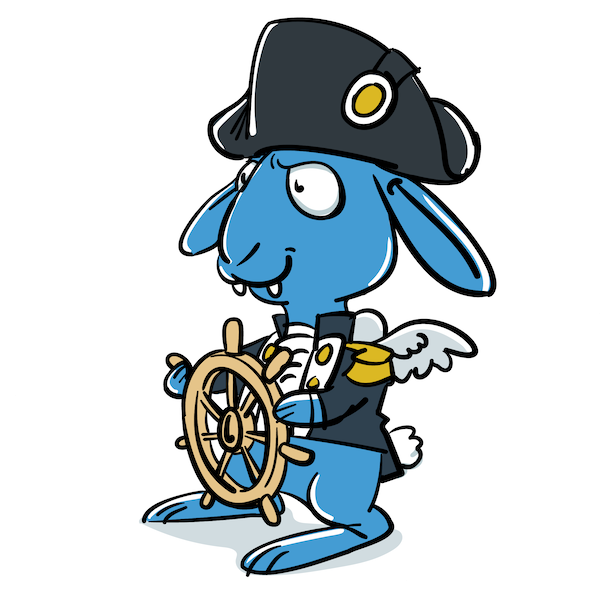

[](https://goreportcard.com/report/github.com/foomo/squadron)
[](https://godoc.org/github.com/foomo/squadron)
[](https://app.codecov.io/gh/foomo/squadron)
[](https://github.com/foomo/squadron/releases)
[](https://hub.docker.com/r/foomo/squadron)
[](https://github.com/foomo/squadron)

<p align="center">
  
</p>

# Squadron

**Docker Compose for Kubernetes.**

Squadron is a CLI that orchestrates multiple Helm charts and Docker image builds
as one cohesive deployment, driven by a single declarative `squadron.yaml`. It
brings the familiar `docker-compose` workflow — define your services once, bring
the whole stack up with one command — to Kubernetes, where each service is a real
Helm release. In production, a squadron is just another set of Helm charts.

📖 **[Read the documentation →](https://foomo.github.io/squadron)**

## Install

```shell
go install github.com/foomo/squadron/cmd/squadron@latest
```

See the [installation guide](https://foomo.github.io/squadron/guide/installation)
for release binaries and the Docker image.

## Example

```yaml
# squadron.yaml
version: '2.3'
squadron:
  storefinder:
    backend:
      chart: <% env "PROJECT_ROOT" %>/charts/backend
      builds:
        default:
          image: docker.mycompany.com/storefinder/backend
          tag: latest
          context: ./app
      values:
        image:
          repository: <% .Squadron.storefinder.backend.builds.default.image %>
          tag: <% .Squadron.storefinder.backend.builds.default.tag | quote %>
```

```shell
squadron build   # build the images
squadron up      # install / upgrade the releases
squadron status  # check release status
squadron down    # tear it down
```

See the [Quick Start](https://foomo.github.io/squadron/guide/quickstart) and the
[configuration reference](https://foomo.github.io/squadron/guide/configuration)
for the full picture.

## How to Contribute

Contributions are welcome! Please read the [contributing guide](docs/CONTRIBUTING.md).


## License

Distributed under MIT License, please see the [license](LICENSE) file for more details.

_Made with ♥ [foomo](https://www.foomo.org) by [bestbytes](https://www.bestbytes.com)_
